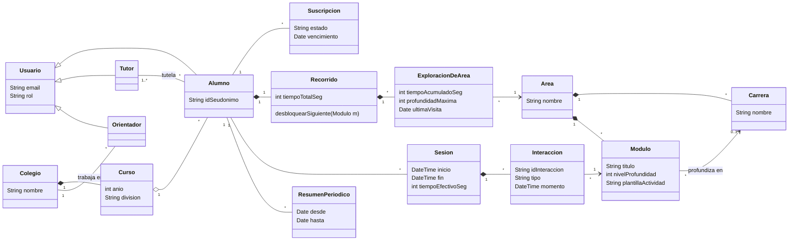
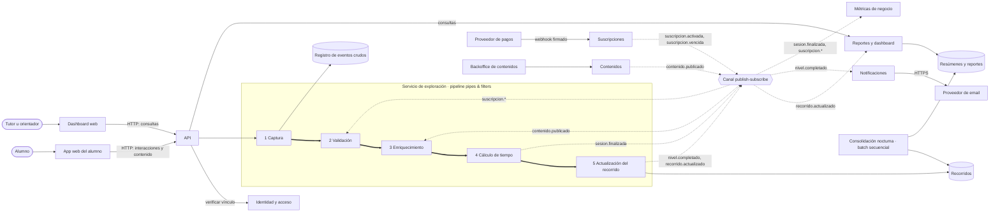
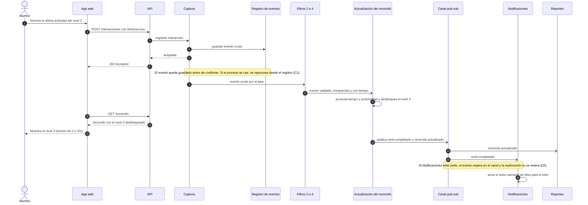
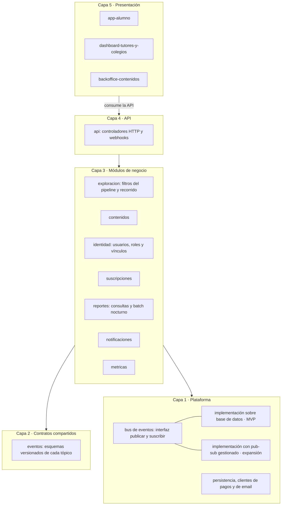
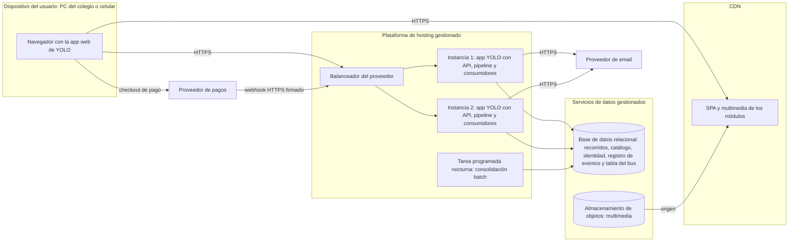

# Clase 9 — Actividad 2: definiciones de arquitectura de YOLO

## Consigna

> Definiciones de Arquitectura
> - Documentar atributos de calidad prioritarios en un árbol de utilidad (atributos y escenarios).
> - Documentar al menos 2 vistas del Modelo 4+1 (1 o 2 diagramas por cada una).
> - Incorporar los estilos de arquitectura definidos en la clase pasada (Actividad 1).
>
> [CL09-P, p. 33]

El producto es **YOLO**; su business case está en [producto-yolo.md](../clase-09-actividad-1/producto-yolo.md) y se cita por sección (§1A, §5B…). Los estilos que hay que incorporar son los de la [Actividad 1](../clase-09-actividad-1/README.md):

- **Pipes & filters** para el pipeline del recorrido, con una consolidación nocturna en **batch secuencial**.
- **Publish–subscribe** para la comunicación entre componentes.
- **Event Stream Processing** como manejo de eventos.

Los diagramas están en [Mermaid](https://mermaid.js.org/): se ven renderizados en GitHub, GitLab, Obsidian y VS Code (con la extensión de vista previa de Mermaid).

## Resumen

| Parte de la consigna | Qué se entrega |
|---|---|
| Árbol de utilidad | 7 atributos de calidad, 15 escenarios medibles con su par [importancia, dificultad] y un orden de prioridad. El escenario más crítico es no perder la exploración del alumno ante una caída (C1). |
| Vistas 4+1 | **Lógica** (diagrama de clases), **procesos** (componentes en ejecución y secuencia de un escenario), **desarrollo** (paquetes en capas) y **física** (despliegue). La consigna pide al menos dos; si hay que presentar solo dos, conviene **procesos** y **física**, que son las que más muestran los estilos y los escenarios prioritarios. |
| Estilos de la Actividad 1 | Cada estilo aparece en al menos dos vistas; la [tabla final](#dónde-aparece-cada-estilo-de-la-actividad-1) indica dónde. |

## Supuestos

Además de los supuestos de la Actividad 1 (clientes web, piloto de uno o dos colegios, latencias distintas para alumnos y padres, equipo chico, pagos externos y datos de menores), esta resolución fija **valores objetivo** para que los escenarios sean medibles. Son propuestas para discutir en el grupo, no datos del business case:

- **Pico de uso en el piloto:** 300 alumnos a la vez (por ejemplo, 10 cursos de 30 alumnos usando la plataforma en el mismo horario de clase).
- **Expansión:** unos 20 colegios y 5.000 alumnos al final del año (§5B, meses 10–12).
- **Horario escolar:** lunes a viernes, de 7 a 18 h.

**Restricciones** (no son atributos de calidad, sino decisiones ya tomadas que acotan el diseño; ver la clase 7): presupuesto de infraestructura acotado (§5A, §7B), equipo chico, un año de plazo (§5B) y una aplicación web sin apps nativas.

## Parte 1 — Árbol de utilidad

### Estructura

El árbol sigue el formato de la clase: la raíz es la utilidad, los nodos de alto nivel son atributos de calidad, los nodos intermedios son características que contribuyen al atributo y las hojas son escenarios. Cada hoja lleva el par **[importancia, dificultad]** con valores alto, medio o bajo (H, M, L): la importancia es para los stakeholders y la dificultad, para lograr el objetivo. [CL09-P, p. 26] Los atributos se nombran según el repaso de la clase 9. [CL09-P, p. 22]

```
Utilidad
├── Confiabilidad
│   ├── Integridad del recorrido ....... C1 (H,H)  Caída con alumnos explorando: 0 interacciones perdidas
│   └── Reintentos del navegador ....... C2 (M,M)  Una interacción reenviada no duplica tiempo
├── Rendimiento
│   ├── Latencia del recorrido ......... R1 (H,M)  Nivel siguiente desbloqueado en menos de 2 s
│   └── Carga de módulos ............... R2 (H,L)  Un módulo carga en menos de 3 s
├── Seguridad
│   ├── Confidencialidad de menores .... S1 (H,M)  Cada tutor ve solo a sus alumnos vinculados
│   │                                    S2 (M,L)  Ningún dato personal circula por el canal
│   └── Pagos .......................... S3 (H,L)  YOLO nunca ve datos de tarjeta
├── Disponibilidad
│   ├── Horario escolar ................ D1 (H,M)  99,5 % de requests exitosos en horario escolar
│   └── Falla de un consumidor ......... D2 (H,L)  Si fallan los avisos, la exploración sigue
├── Escalabilidad
│   ├── Picos en horario de clase ...... E1 (H,M)  300 alumnos a la vez sin degradar la respuesta
│   └── Crecimiento de colegios ........ E2 (M,M)  De 2 a 20 colegios sin tocar productores ni consumidores
├── Modificabilidad
│   ├── Nuevas métricas ................ M1 (H,L)  Métrica nueva sin modificar filtros existentes
│   └── Contenido ...................... M2 (H,M)  Módulo nuevo publicado sin desarrolladores
└── Administrabilidad
    └── Trazabilidad ................... A1 (M,M)  Reconstruir una sesión ante un reclamo
                                         A2 (M,L)  Alerta si se acumulan eventos sin procesar
```

### Escenarios

Un escenario es una breve narrativa de una situación potencial, desde el punto de vista de un stakeholder, que se formula como «¿qué pasa si…?». [CL09-P, p. 15] Como en el ejemplo de la clase, cada hoja tiene una medida concreta, no un deseo vago. [CL09-P, p. 26]

| ID | ¿Qué pasa si…? | Respuesta esperada y medida | Stakeholder | [I, D] | Por qué ese par |
|---|---|---|---|---|---|
| C1 | …se cae una instancia de la aplicación mientras 300 alumnos están explorando? | Ninguna interacción que el sistema confirmó se pierde; al reiniciar se reprocesan y el recorrido queda consistente en menos de 5 min. | Tutor, colegio | (H, H) | El recorrido es el valor diferencial del producto (§2B). Es difícil porque el pipeline es asincrónico: hay que persistir antes de confirmar y reprocesar sin duplicar. |
| C2 | …el navegador reenvía la misma interacción por un corte de conexión? | El tiempo dedicado no se cuenta dos veces: 0 duplicados en el recorrido. | Tutor | (M, M) | Un duplicado distorsiona poco las métricas, pero exige identificar cada interacción. |
| R1 | …un alumno completa un nivel? | El nivel siguiente aparece desbloqueado en menos de 2 s (p95). | Alumno | (H, M) | La experiencia es progresiva (§1A) y la espera desmotiva, que es el riesgo de contenido poco atractivo (§4A). La dificultad es media porque el pipeline es asincrónico. |
| R2 | …un alumno abre un módulo con video desde una conexión de 10 Mbps? | La primera pantalla del módulo carga en menos de 3 s (p95). | Alumno | (H, L) | Importa por la misma razón que R1; con una CDN es fácil de lograr. |
| S1 | …un tutor intenta ver el recorrido de un alumno que no tiene vinculado, o un orientador el de otro colegio? | El 100 % de los intentos se rechaza y queda registrado. | Familias, colegio | (H, M) | Son datos de menores (conocimiento general: en Argentina rige la Ley 25.326 de protección de datos personales). Hay que controlar el vínculo en cada consulta. |
| S2 | …se inspeccionan los eventos que circulan por el canal pub-sub? | Ningún evento lleva nombre, email ni documento: solo un identificador seudonimizado del alumno. | Familias | (M, L) | Reduce el daño si se filtra un evento; basta con definirlo en los contratos de evento. |
| S3 | …una familia paga la suscripción, o llega una notificación de pago falsa? | YOLO no almacena ni ve datos de tarjeta; el 100 % de las notificaciones sin firma válida del proveedor se rechaza. | Familias, equipo | (H, L) | Un fraude afecta ingresos y reputación; delegar el cobro al proveedor lo hace fácil. |
| D1 | …un colegio usa la plataforma en horario de clase durante un mes? | Al menos el 99,5 % de los requests son exitosos en horario escolar (SLI: porcentaje de requests exitosos; SLO: 99,5 % mensual). | Colegio | (H, M) | Si falla en clase, el docente la abandona (baja adopción, §4A). Las siglas siguen a [CL09-P, p. 17]. |
| D2 | …se cae el módulo de notificaciones, el de reportes o el proveedor de email? | Los alumnos siguen explorando sin errores; los eventos pendientes se procesan al recuperarse, sin pérdida. | Alumno | (H, L) | Lo resuelve casi gratis el desacoplamiento de pub-sub. |
| E1 | …300 alumnos usan la plataforma a la vez en horario de clase? | El tiempo de respuesta se mantiene por debajo de 2 s (p95) sin intervención manual. | Alumno, colegio | (H, M) | Es el uso típico en el colegio; requiere instancias sin estado y autoescalado. |
| E2 | …YOLO pasa de 2 a 20 colegios (unos 5.000 alumnos)? | Se cambia solo infraestructura (más instancias y un servicio pub-sub gestionado) sin modificar productores ni consumidores, en menos de 2 semanas-persona. | Equipo | (M, M) | Depende del piloto (§7B), por eso la importancia es media. |
| M1 | …el piloto pide una métrica nueva, como «áreas que el alumno revisitó»? | Se agrega un filtro o un consumidor sin modificar los existentes, en menos de 1 semana-persona con pruebas. | Equipo | (H, L) | El business case prevé ajustar métricas tras el piloto (§4B); pipes & filters y pub-sub lo facilitan. |
| M2 | …el equipo de contenidos quiere publicar un módulo o un nivel nuevo? | Lo publica desde el backoffice, sin desarrolladores ni redeploy; los alumnos lo ven en menos de 10 min. | Equipo de contenidos | (H, M) | Actualizar contenido según los intereses de los alumnos es una mitigación del business case (§4B). Es medio porque los módulos interactivos tienen que modelarse como datos. |
| A1 | …un tutor reclama que el tiempo de su hijo está mal calculado? | El equipo reconstruye la sesión a partir de su identificador y de los eventos crudos en menos de 30 min. | Equipo | (M, M) | Ataca una desventaja de los sistemas basados en eventos: cuesta encontrar la causa raíz y rastrear una operación de punta a punta. [CL08-P, p. 56] |
| A2 | …se acumulan eventos sin procesar o el pipeline se atrasa? | El equipo recibe una alerta en menos de 5 min si hay más de 1.000 eventos pendientes o más de 1 min de atraso. | Equipo | (M, L) | El monitoreo es parte de la administrabilidad (operar el sistema en producción). [CL09-P, p. 22] |

### Prioridad

**Inferencia:** según el par [I, D], el orden de análisis es:

1. **(H, H):** C1. Es importante y difícil a la vez, así que va primero.
2. **(H, M):** R1, S1, D1, E1, M2. Son el núcleo de la arquitectura.
3. **(H, L):** R2, S3, D2, M1. Importan mucho, pero los estilos elegidos ya los resuelven.
4. **(M, M) y (M, L):** C2, E2, A1, S2, A2.

### Atributos que no entran en el árbol

- **Usabilidad:** es clave para el producto, pero se resuelve sobre todo con diseño de interfaz y validación con estudiantes (§4B), no con decisiones de arquitectura. La arquitectura la apoya a través de R1 y R2.
- **Portabilidad:** una aplicación web adaptable ya cubre computadoras y celulares; no hay apps nativas en el primer año.
- **Interoperabilidad:** las únicas integraciones son pagos y email, con APIs estándar; quedan cubiertas por S3 y D2.
- **Reusabilidad y testabilidad:** no son drivers en esta etapa. **Inferencia:** los filtros independientes del pipeline igual se pueden probar por separado.

## Parte 2 — Vistas del modelo 4+1

Cada vista responde una pregunta distinta y usa los diagramas que indica la clase: clases o componentes para la lógica, secuencia, actividades o comunicación para la de procesos, componentes o paquetes para la de desarrollo y despliegue para la física. [CL08-P, p. 14]; [CL08-P, p. 15] El modelo se adapta a cada caso y las vistas no deben contradecirse. [CL08-P, p. 17]

En la Actividad 1 se habló de «servicios» (exploración, suscripciones, contenidos…). Acá se aclara que son **módulos lógicos**: en el MVP corren todos dentro de una misma aplicación desplegable, como se recomendó allí para un proyecto chico. [CL09-P, p. 5]

### Vista lógica

**Pregunta:** ¿cómo está organizado el sistema desde el punto de vista de las funcionalidades? [CL08-P, p. 14] **Stakeholder:** usuario final. [CL08-P, p. 11]

**Diagrama 1 — Modelo de dominio (diagrama de clases)**



**Decisiones que muestra:**

- **El recorrido es un agregado calculado.** `Sesion` y `Recorrido` no los carga nadie a mano: los producen los filtros 4 y 5 del pipeline a partir del flujo de `Interaccion` (Event Stream Processing). `ResumenPeriodico` lo genera la consolidación nocturna en batch.
- **El contenido es dato, no código** (M2). Áreas, carreras y módulos se editan desde el backoffice. Cada `Modulo` usa una `plantillaActividad` ya programada (video, cuestionario, simulación…), así que publicar un módulo no requiere un deploy. Un módulo de nivel *n* requiere haber completado el de nivel *n − 1* de la misma área.
- **Los permisos salen de los vínculos** (S1). Un tutor accede solo a los alumnos que `tutela`, y un orientador solo a los alumnos de su `Colegio`.
- **Los eventos usan `idSeudonimo`** (S2). Los datos personales quedan en `Usuario`, dentro del módulo de identidad.
- **`idInteraccion`** lo genera el navegador, y permite descartar reenvíos (C2).

### Vista de procesos

**Pregunta:** ¿cómo se comporta el sistema en tiempo de ejecución? Su foco son la concurrencia, la comunicación, la sincronización y el rendimiento. [CL08-P, p. 14] **Stakeholders:** integradores y diseñador del sistema. [CL08-P, p. 11] Es la vista donde viven los tres estilos de la Actividad 1; Kruchten menciona pipes and filters como estilo posible para esta vista. [B01, p. 6]

**Diagrama 2 — Componentes en ejecución y comunicación**

Sigue la convención del ejemplo de Netflix de la clase: flecha continua para comunicación sincrónica y punteada para asincrónica. [CL08-P, p. 20] Se agrega una flecha gruesa para los pipes del pipeline.



**Lectura del diagrama:**

- **Pipes & filters:** las cinco etapas del pipeline de la Actividad 1, unidas por pipes en memoria dentro del mismo proceso, lo que es rápido para R1. La captura escribe cada evento en el **registro de eventos crudos** antes de confirmarlo (C1), y ese registro también sirve para reconstruir sesiones (A1).
- **Publish–subscribe:** el canal desacopla productores y consumidores. Exploración publica sin saber quién escucha, y también consume eventos de otros módulos: el estado de las suscripciones para validar y el catálogo para enriquecer. Agregar un consumidor no toca a nadie (M1, D2).
- **Event Stream Processing:** los filtros 2 a 5 transforman y agregan el flujo de interacciones en línea.
- **Batch secuencial:** la consolidación nocturna lee los recorridos y genera resúmenes; no está en el camino del alumno.

**Diagrama 3 — Escenario «el alumno completa un nivel» (secuencia)**

Recorre los escenarios R1, C1 y D2 sobre la vista de procesos. La clase admite diagramas de secuencia en esta vista. [CL08-P, p. 14]



### Vista de desarrollo

**Pregunta:** ¿cómo se organiza el software en el entorno de desarrollo? Su foco es la estructura estática de módulos, componentes y paquetes, pensada para los desarrolladores. [CL08-P, p. 15] **Stakeholders:** programadores y gestión del software. [CL08-P, p. 11]

**Diagrama 4 — Paquetes en capas**

Kruchten recomienda el estilo en capas para esta vista: un subsistema solo depende de subsistemas de su misma capa o de capas inferiores. [B01, p. 8] Es el estilo de capas que la Actividad 1 descartó como pipeline y dejó para esta vista.



**Reglas de dependencia:**

- **Solo hacia abajo.** Ningún paquete importa uno de una capa superior. [B01, p. 8]
- **Los módulos de negocio no se importan entre sí.** Kruchten permite dependencias dentro de la misma capa, pero acá se agrega una regla más estricta: los módulos se comunican **solo por eventos** del paquete `eventos`, o por la interfaz pública de `identidad` para verificar permisos (S1). Así cada módulo puede sacarse a un servicio aparte en la expansión sin reescribir los demás (E2).
- **Ningún módulo conoce la implementación del bus.** Usan la interfaz de `bus de eventos`, y la implementación se elige por configuración. Pasar del MVP a la expansión es cambiar de implementación (E2).
- **Los contratos de evento son el único acoplamiento entre módulos.** Por eso se versionan, y un filtro o consumidor nuevo se agrega como paquete nuevo (M1). Esto también mitiga la dificultad de coordinar filtros de pipes & filters. [CL08-P, p. 27]

### Vista física

**Pregunta:** ¿dónde y cómo se ejecuta el sistema en la infraestructura física? Su foco es la asignación del software al hardware y a las redes. [CL08-P, p. 15] **Stakeholders:** ingenieros de sistemas. [CL08-P, p. 11]

**Diagrama 5 — Despliegue del MVP y del piloto**



**Decisiones que muestra:**

- **Dos instancias sin estado** detrás del balanceador del proveedor, con autoescalado en horario escolar (E1, D1). Toda la información vive en la base de datos, así que cualquier instancia atiende a cualquier alumno.
- **El bus del MVP se apoya en la base de datos.** Es un refinamiento de la Actividad 1, que proponía un bus interno. Los eventos de dominio se escriben en una tabla del bus **en la misma transacción** que actualiza el recorrido, y los consumidores la leen desde cualquier instancia. **Conocimiento general:** es el patrón *transactional outbox*. Así un evento no se pierde si una instancia se cae (C1), funciona con dos instancias y no agrega otro servicio que pagar (restricción de costos, §5A).
- **CDN para el contenido pesado** (R2): los videos no pasan por las instancias de la aplicación.
- **El cobro ocurre en el proveedor de pagos** (S3): el navegador va a su checkout, y YOLO solo recibe un webhook firmado.
- **Tarea programada aparte** para el batch nocturno, para no competir con el tráfico de los alumnos.

**Cómo evoluciona en la expansión (meses 7–12).** Es el *architectural runway* de la Actividad 1: anticipar lo necesario a corto y mediano plazo sin adivinar todo. [CL09-P, p. 11]

| Elemento | MVP y piloto | Expansión, si las métricas lo justifican |
|---|---|---|
| Canal pub-sub | Tabla del bus en la base de datos | Servicio pub-sub gestionado (E2) |
| Pipeline | Dentro de las instancias de la app | Workers aparte que escalan por su cuenta; los pipes pasan a ser tópicos, como en el ejemplo de Kafka [CL08-P, p. 33] |
| Instancias | Dos, con autoescalado | Más instancias según la carga en horario escolar |
| Base de datos | Una instancia gestionada con backups | Réplica con failover si el SLO sube a 99,9 % |

## Escenarios prioritarios sobre las vistas (+1)

En el modelo 4+1, los escenarios muestran que las demás vistas funcionan en conjunto. [CL08-P, p. 16] Lightweight ATAM propone presentar la arquitectura con uno o dos escenarios ejecutados sobre las vistas, y mapear en ella los escenarios de mayor prioridad. [CL09-P, p. 31] Esta tabla lo hace con los escenarios (H, H) y (H, M). Las categorías de hallazgo son las de la clase: riesgo, no riesgo, punto sensible y trade-off. [CL09-P, p. 28] Sus definiciones son conocimiento general (SEI), registradas en la [wiki](../../wiki/temas/evaluacion-de-arquitecturas.md).

| Escenario | Cómo lo resuelve la arquitectura | Vistas | Hallazgo |
|---|---|---|---|
| C1 (H,H) | La captura guarda el evento crudo antes de responder 202; los filtros reprocesan desde el último evento procesado; los eventos de dominio se publican en la misma transacción que el recorrido. | Procesos (diagramas 2 y 3), física | **Punto sensible:** el momento en que se persiste el evento. **Trade-off confiabilidad–rendimiento:** cada interacción paga una escritura extra antes de confirmarse. |
| R1 (H,M) | El pipeline corre en memoria dentro de la misma instancia; el recorrido se actualiza en milisegundos y la app lo vuelve a leer. | Procesos (diagrama 3) | **No riesgo:** alcanza con pipes en memoria para la latencia pedida. Los consumidores lentos no frenan al alumno porque están del otro lado del canal. |
| S1 (H,M) | Los vínculos `tutela` y `trabaja en` definen el acceso; la API consulta a `identidad` en cada request; los eventos no llevan datos personales (S2). | Lógica, procesos, desarrollo | **Punto sensible:** el chequeo del vínculo en cada consulta. **Riesgo:** un endpoint nuevo que se olvide de hacerlo. Mitigación: centralizar el chequeo en la API, no en cada módulo. |
| D1 (H,M) | Dos instancias sin estado con autoescalado; base de datos gestionada con backups. | Física | **Riesgo:** la base de datos es un punto único de falla. **Trade-off disponibilidad–costo:** el SLO de 99,5 % se eligió porque alcanza con una sola instancia gestionada; subir a 99,9 % exige una réplica con failover y más costo. |
| E1 (H,M) | Instancias sin estado detrás del balanceador. **Estimación (inferencia):** 300 alumnos con una interacción cada 10 s generan unos 30 eventos por segundo. | Física | **No riesgo:** alcanza con una base de datos gestionada para el volumen del piloto. |
| M2 (H,M) | El contenido es dato (`Modulo` con `plantillaActividad`); `contenido.publicado` actualiza el catálogo que usa el filtro de enriquecimiento. | Lógica, procesos | **Riesgo:** un tipo de actividad que no existe como plantilla sí requiere programar y desplegar. Mitigación: armar el catálogo de plantillas durante el MVP con los tipos de actividad más pedidos. |

## Dónde aparece cada estilo de la Actividad 1

| Estilo | Vista lógica | Vista de procesos | Vista de desarrollo | Vista física |
|---|---|---|---|---|
| Pipes & filters | `Sesion` y `Recorrido` como resultado de los filtros | Subgrafo del pipeline (diagrama 2); filtros en la secuencia (diagrama 3) | Paquete `exploracion` con un filtro por componente | Corre dentro de las instancias; en la expansión, workers aparte |
| Batch secuencial | `ResumenPeriodico` | Consolidación nocturna (diagrama 2) | Dentro de `reportes` | Tarea programada nocturna |
| Publish–subscribe | — | Canal con sus tópicos y suscriptores (diagramas 2 y 3) | Paquete `eventos` y bus de eventos con dos implementaciones | Tabla del bus en la base de datos; servicio gestionado en la expansión |
| Event Stream Processing | Agregados calculados desde `Interaccion` | Filtros 2 a 5 que transforman y agregan en línea | — | — |
| Capas | — | — | Las cinco capas del diagrama 4 | — |

## Dudas abiertas

- **Valores objetivo:** los números de los escenarios (300 alumnos, 2 s, 99,5 %, 10 min…) son propuestas; el grupo debería ajustarlos a lo que espera del piloto.
- **Qué ven los orientadores:** si ven datos individuales o solo agregados del curso. Cambia S1 y el modelo de la vista lógica.
- **Cuántas vistas presentar:** la consigna pide al menos dos. Si el grupo presenta solo dos, procesos y física cubren los tres estilos y los escenarios C1, R1, D1 y E1.
- **Diagramas de secuencia:** la clase los ubica a veces en la vista lógica y a veces en la de procesos; acá se usaron en procesos. Está registrado en [dudas y conflictos](../../wiki/dudas-y-conflictos.md).
- **Si la actividad es evaluada:** se guardó en `practica/`, igual que la Actividad 1. Si es una entrega, conviene moverla a `entregas/`.
